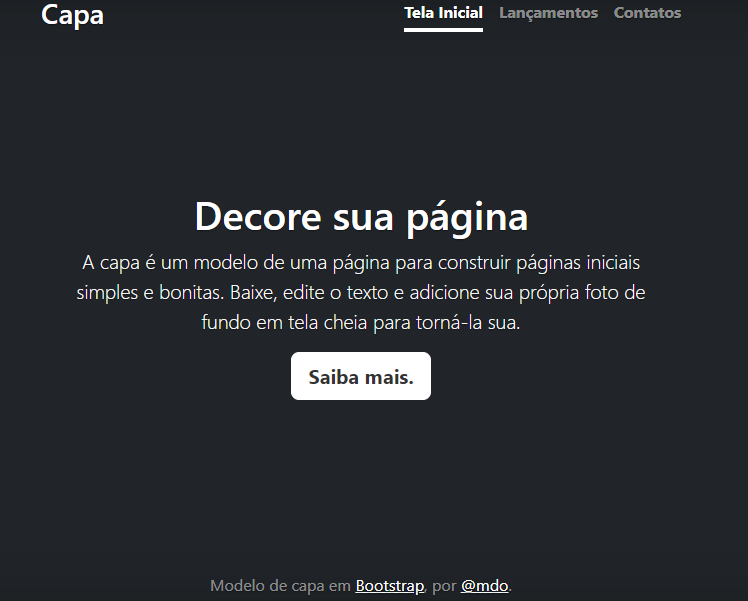

# Índice
[PROJETO : portifolio-pessoal](#projeto--portifolio-pessoal)  
[Descrição](#descri%C3%A7%C3%A3o)  
[Introdução](#introdu%C3%A7%C3%A3o)  
[Funcionalidades](#funcionalidades)  
[Tecnologias](#tecnologias)  
[Fontes Consultadas](#fontes-consultadas)  
[AUTORES](#autores)  

# PROJETO : portifolio-pessoal

Projeto criado utilizando exemplo do Bootstrap para ensino de uso do README e do Boostrap.

## Descrição

O portfólio pessoal seré uma combinação dos projetos desenvolvidos por mim durante nossas aulas de Desenvolvimento WEB. Com finalidade inicial de ajudar os alunos com melhoria da preparação do README.

## Introdução

## Funcionalidades

### Tecnologias

HTML, VSCODE, Bootstrap, GITHUB, GIT,

## Fontes Consultadas

https://www.alura.com.br/artigos/escrever-bom-readme

https://gist.github.com/lohhans/f8da0b147550df3f96914d3797e9fb89

## AUTORES

Layla Beatrice e Maria Eduarda Mendes. 💕💕💕

